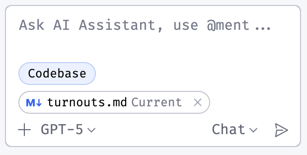

# Getting Started

Welcome to the app! This guide will help you get up and running.

## First Launch

Is this getting updated?

When you open the app, you’ll see the **Start Page**.  
From here you can:

- Create or load a **Panel**.
- Switch between **Operate Mode** and **Design Mode**.
- Access this **Help system**.

## Navigating Help

- Use the **Help button** on the start page.
- Follow links inside topics, such as [Turnouts](help://topic/turnouts).
- Search from the Help index.

## Next Steps

- [Operate Mode](help://topic/operate-mode)
- [Design Mode](help://topic/design-mode)

