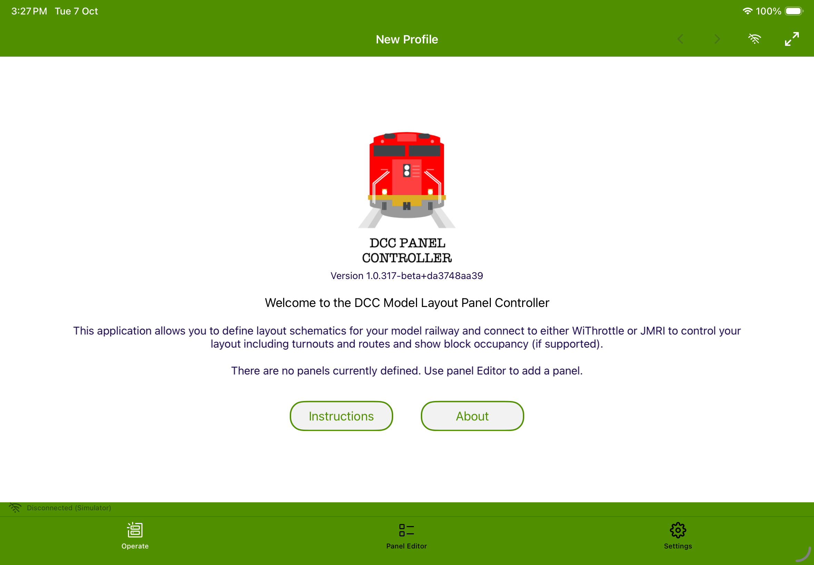

# Getting Started

Welcome to the **DCC Panel Controller** application. This application is designed to allow you to mimic a model railroad control panel without the need for hardware and to allow you to use it on mobile devices such as tables and phones. 

Currently we support iPad and iPhone and the iPad version can run on a Mac. In the future, if there is demand, we can support Android and Windows.

DCC System support is currently limited to WiThrottle and JMRI (and a simulator). If there is demand we can add support for other DCC systems. See the [DCC connection](help://topic/connections) topic for the capabilities that each connection type supports. 

This guide will help you get up and running.

## First Launch

When you first launch the application you will see the Welcome page which is how you go to this help page. There ar 3 tabs at the bottom of the page:

- [Operate: ](help://topic/operate)This is where you operate the panel and run your layout. 
- [Editor: ](help://topic/editor) This is where you design the panel layout(s).
- [Settings: ](help://topic/editor)    This is where you configure profiles and settings. 

At the top of the page, on the toolbar you will see a maximize button, connect button and < > buttons to switch between panels. 

At the bottom of the page, on the panel to the left you will see the state of the current [DCC connection](help://topic/connections) and to the right you will see the current [profile](help://topic/profiles). 

## Next Steps

1. Start by trying out the sample layout that pre-setup when you first launch the application. 
2. If you want to try some other more complex layouts, there are a number of profile templates available in settings. You can add a new profile and select one of the samples. 
3. When you are ready, you can create your own profile and from the editor you can add tracks and tiles to the panel. 

## Navigating Help

- Use the **Help button** on the start page.
- Follow links inside topics, such as [Turnouts](help://topic/turnouts).
- Search from the Help index.
