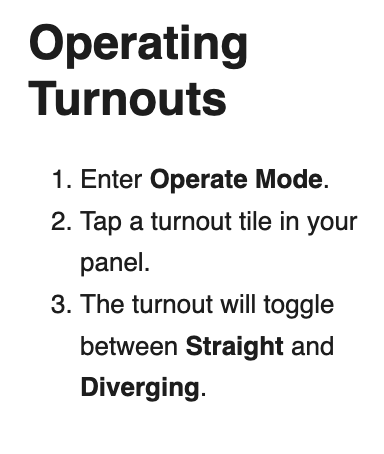

# Turnouts

Turnouts (also called **points** or **switches**) are used to change the route of a train from one track to another.

## Operating Turnouts

1. Enter **Operate Mode**.
2. Tap a turnout tile in your panel.
3. The turnout will toggle between **Straight** and **Diverging**.

## Configuring Turnouts

- In **Design Mode**, select the turnout tile.
- Use the **Properties** panel to configure:
    - Address / ID
    - Default state
    - Linked signals (optional)

## Related Topics

- [Tiles](help://topic/tiles)
- [Operate Mode](help://topic/operate-mode)

